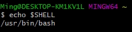
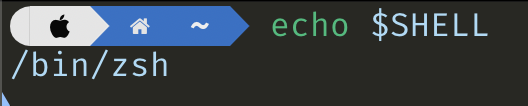
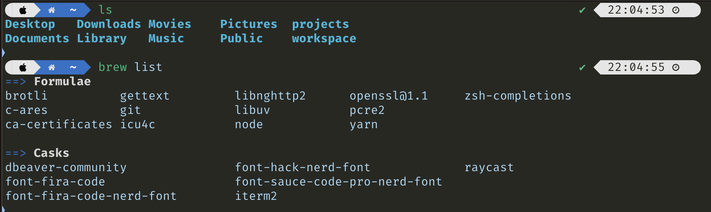
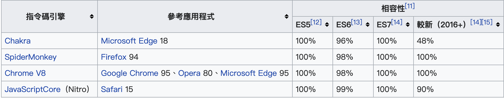

# Frontend Note

---

### Contents

::: block
- Shell
- Command Line Interface(CLI)
- Git
- Nodejs
- JavaScript Engine & Runtime
- Runtime API
- ECMAScript
- Coding Time{style=color:yellow}
- JavaScript
::: 

---

### Shell

::: block{style=text-align:left;font-size:36px}
In computing, a shell is a computer program that exposes an operating system's services to a human user or other programs. 

In general, operating system shells use either a `command-line interface (CLI)`{style=color:yellow} or `graphical user interface (GUI)`{style=color:yellow}, depending on a computer's role and particular operation. 

<!-- It is named a shell because it is the outermost layer around the operating system.  -->
:::

---

### Shell

- Windows OS: CMD, PowerShell, Git Bash

- MacOS: Bash, Zsh
:::

{width="100%"}

---

### Command Line Interface (CLI)

::: block{style=text-align:left;}
CLI is a means of interacting with a device or computer program with commands from a user or client.

:::block{style=text-align:left}
- shell (cd, cat, echo...)
- package (brew, git, node...)
:::

<!-- 
---

### Zsh

::: block{style=text-align:left;}
Zsh is a shell designed for interactive use, although it is also a powerful `scripting language`{style=color:yellow}. Many of the useful features of bash, ksh, and tcsh were incorporated into zsh; many original features were added.

> A scripting language is one that is well suited to writing programs which are more like a long list of commands. {style=width:100%}

- [oh my zsh](https://github.com/ohmyzsh/ohmyzsh)
:::
-->

---

### Git

:::block{style=text-align:left}
Git is a free and open source `distributed version control system`{style=color:yellow} designed to handle everything from small to very large projects with speed and efficiency.

- Github
- Git Flow

[learn git branching](https://learngitbranching.js.org/)
:::

---

### Nodejs

:::block{style=text-align:left;}
Node.js® is an open-source, cross-platform `JavaScript runtime environment`{style=color:yellow}.
:::

> The runtime environment is the environment in which a program or application is executed.{style=width:100%}

:::block{style=text-align:left;}
npm (Node Package Manager)

- the website
- the CLI
- the registry

[Node School](https://nodeschool.io/)
:::

---

### JavaScript Engine & Runtime

##### `engine`{style=color:yellow}
:::block{style=text-align:left}
> A program or interpreter that understands and executes JavaScript code.{style=width:100%}

ex: V8, SpiderMonkey
:::

##### `runtime`{style=color:yellow}
:::block{style=text-align:left}
> The runtime provides `the host objects`{style=color:yellow} that JavaScript can operate on and work with.
{style=width:100%}
- Nodejs: path, filesystem
- Chrome: document, window
:::

---

### Runtime API

> APIs are mechanisms that enable two software components to communicate with each other using a set of definitions and protocols.{style=width:100%}

      

[Nodejs API](https://nodejs.org/api/)

- [console.log](https://nodejs.org/api/console.html#consolelogdata-args)

- [setTimeout](https://nodejs.org/dist/latest-v20.x/docs/api/timers.html#settimeoutcallback-delay-args)

- [path.relative](https://nodejs.org/dist/latest-v20.x/docs/api/path.html#pathrelativefrom-to)

- [fs.write](https://nodejs.org/api/fs.html#fswritefd-buffer-offset-length-position-callback)

[Web API](https://developer.mozilla.org/zh-TW/docs/Web/API)

- [console.log](https://developer.mozilla.org/en-US/docs/Web/API/console/log)

- [setTimeout](https://developer.mozilla.org/en-US/docs/Web/API/setTimeout)

- [window.open](https://developer.mozilla.org/en-US/docs/Web/API/Window/open)

- [document.createElement](https://developer.mozilla.org/en-US/docs/Web/API/Document/createElement)

---

---

### ECMAScript

:::block{style=text-align:left}
The specification defined in ECMA-262 for creating a general purpose scripting language.

- [ES5 vs ES6(ES2015)](https://www.javatpoint.com/es5-vs-es6)

:::
 

##### Babel{style=text-align:left}
> A transpiler that can convert ES6 code to ES5 code.{style=width:100%}

---

### Coding Time

:::block{style=text-align:left}

##### requirements

- Shell 
  - MacOS: Zsh or Bash
  - WindowsOS: Git Bash
- Git
  - `git -v`{style=color:yellow}
- Node
  - `node -v`{style=color:yellow}
  - `npm -v`{style=color:yellow}

- IDE
  - VSCode

- repository
  - [git clone](https://github.com/MingHHsu/frontend-note.git)

  - code frontend-note

:::

---

### JavaScript

- Data Types
- Operators
- Dynamic Typing
- prototype-based
- object-orientation
- first-class functions

---

### Data Types

- String
- Number
- Bigint
- Boolean
- Undefined
- Null
- Symbol
- Object(array, object...)

---

---

<!-- .slide: style="text-align: left;" -->
# THE END

- [Try the online editor](http://slides.com)
- [Source code & documentation](https://github.com/hakimel/reveal.js)